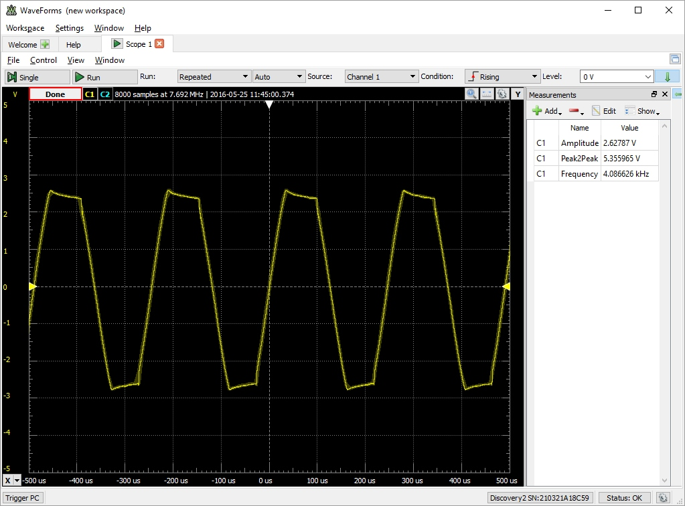

# Personal-belongings-security-alarm
author: Jonathan Hull  
date: May 24, 2016  

This repository contains files for a term project on building the RC feedback oscillator shown in the following schematic.  This was the final project in ENGR12L, Engineering Circuits Lab, at Monterey Peninsula College in the Spring 2016 semester.  

The primary feature of the circuit is an RC phase shift oscillator that should produce a sine wave of about 4 kHz.  The circuit is inactive until a short circuit to ground is removed at which time a distinctive sound is emitted.  Conceptually, the wire that shorts the circuit could be attached to an item in someone's pocket and the alarm would sound if the item is removed by a thief. 

# Theoretical background

The circuit in this project generates a sine wave by looping a current through a feedback network comprised of three RC stages.  Each stage generates a 60 degree phase shift.  The result is passed to the inverting input of the opamp that provides another 180 degrees of phase shift.  The 360 degrees of phase shift plus sufficient gain from the opamp guarantees that the circuit will produce a continuous sine wave [4].  Theoretical analysis of the circuit predicts that f = sqrt(6)/(2*pi*R*C) = 3898 Hz when R=1k ohms and C=100 nF [5].

# Project steps

The project was started in late April with a target completion date of June 2, 2016.  The first step was implementation of the design in circuitlab.  This helped in understanding the circuit but unfortunately a model for the LM380 opamp could not be located and thus circuitlab could not run simulations.  Nevertheless, circuitlab does contain links that were quite useful in ordering the components needed to build a prototype.

The prototype shown below was constructed with the 14 pin version of the LM380 because it was readily available.   The prototype was initially tested with a 6V power supply because [2] indicated that it was the preferred choice.  However, that did not work correctly and a 9V supply was adopted after we observed that it was used in [1].  

An additional goal of building a printed circuit board (PCB) for the circuit was pursued at the author's own volition.  Some brief web searching showed that building a PCB requires two steps: design with a software package and sending Gerber files to a PCB manufacturer.  The manufacturer uses the Gerber files to produce the board.  After it's returned, the components are soldered onto it.

After some analysis of the available alternatives, the Eagle software PCB design package was chosen because of its popularity in the Arduino community and the the fact that it's free for educational purposes.  Eagle requires the user to provide a schematic and it creates a corresponding design for a PCB.  The design shows where components are placed on the board and the precise location of tracks between each component.  The tracks correspond to wires in the prototype that will become copper traces on the PCB.

The Eagle package was relatively straightforward to use because of the excellent directions in [3].  Within a day, the following design for a 2x2cm two-layer board was complete.  The components and holes for their wires are also shown as well as the traces between holes.  The brown traces are on the top layer of the board.  The blue traces are on the bottom.

The Eagle package also outputs Gerber files.  After getting quotes from three vendors, [itead.cc](http://itead.cc) was chosen.  They agreed to produce 12 "bare boards" (without components soldered on) for $9.90.  The Gerber files were uploaded to their web site on Friday May 13 and the boards were delivered on Monday May 23.  This was a relatively simple two-layer design with all "through hole" components.  Both sides of the bare board are shown below.

The boards were ordered from itead as a two layer PCB, 5cm x 5cm max, 1.6mm thick, HASL surface finish, 100% E-test, and 1 oz. thick copper.  The traces were 10mil wide with 20mil minimum space between traces.  These are normal parameters and were perfectly adequate for this design.

The final version of the board shown below was produced by soldering the components on one of the bare boards.  Happily, this worked correctly the first time it was tried.  Needless to say, this was a huge relief since a mistake could only be corrected with another ten day turnaround from itead.

# Experimental Results

Verification of the theoretical prediction that the circuit would produce a 4 kHz sine wave was done by connecting the first channel of the Digilent Analog Discovery 2 USB oscilloscope to the speaker terminals.  The voltage trace is shown below.  We see a waveform that's shaped like a sine wave, but not as smooth as it should be.  The frequency of the waveform is 4.09 kHz which is within about 4.8% ((|3898-4087|/3898)*100) of the theoretically predicted value of 3.90 kHz.  A video illustrating the operation of the circuit is available at https://youtu.be/Xsj34tHOlkY

# Files

The Eagle schematic, board file and Gerber files in the format required by itead are in this github repository.

# Conclusions

This project shows how a sine wave can be generated with a handful of low cost components and is an excellent example of a circuit with practical applications.  Production of the PCB was an interesting addition to the project that shows how an abstract design expressed in a schematic can be reduced to a form that could be used in a real product.  First hand knowledge of this process is something that every electrical enginer and computer scientist should have as they progress through their career.

# References

[1].  N. Alsbou, K. Al-Olimat, V. Labay, and H. LeBlanc, "Introducing Students to Electronic Devices and Electric Circuit Applications at Early Level in the Engineering Curriculum through Multiple Projects,"  122nd ASEE Annual Conference and Exposition, Seattle, WA, June 14-17, 2015. https://www.asee.org/public/conferences/56/papers/12964/download.

[2]. "Pull Pin Security Alarm System," http://www.electronicshub.org/pull-pin-security-alarm-system/, Aug. 5, 2015.

[3].  S. Monk, Make your own PCBs with Eagle: from schematic designs to finished boards, McGraw-Hill, 2014.

[4]. Electronic Oscillators and its Feedback Network, https://www.youtube.com/watch?v=aAiZsJz4UW8&feature=youtu.be

[5]. Gate 2003 ECE Op Amp RC phase shift oscillator, https://www.youtube.com/watch?v=BdULnwS91ts&feature=youtu.be

# Additional background references

[a].  RC Phase Shift Oscillator, http://www.visionics.a.se/html/curriculum/Experiments/RC%20Phase%20Shift%20Oscillator/RC%20Phase%20Shift%20Oscillator1.html

[b].  How do Sinusoidal Oscillations Arise in RC Oscillators, https://www.researchgate.net/post/How_do_sinusoidal_oscillations_arise_in_RC_oscillators#share

[c]. What is the Basic Idea of a Wien Bridge Oscillator?, https://www.researchgate.net/post/What_is_the_basic_idea_of_Wien_bridge_oscillator_How_does_it_operate

[d]. Sine Wave Oscillator using LM741 (contains concise description of Barkhausen Criteria), http://www.engineersgarage.com/contribution/sine-wave-oscillator-using-lm741

