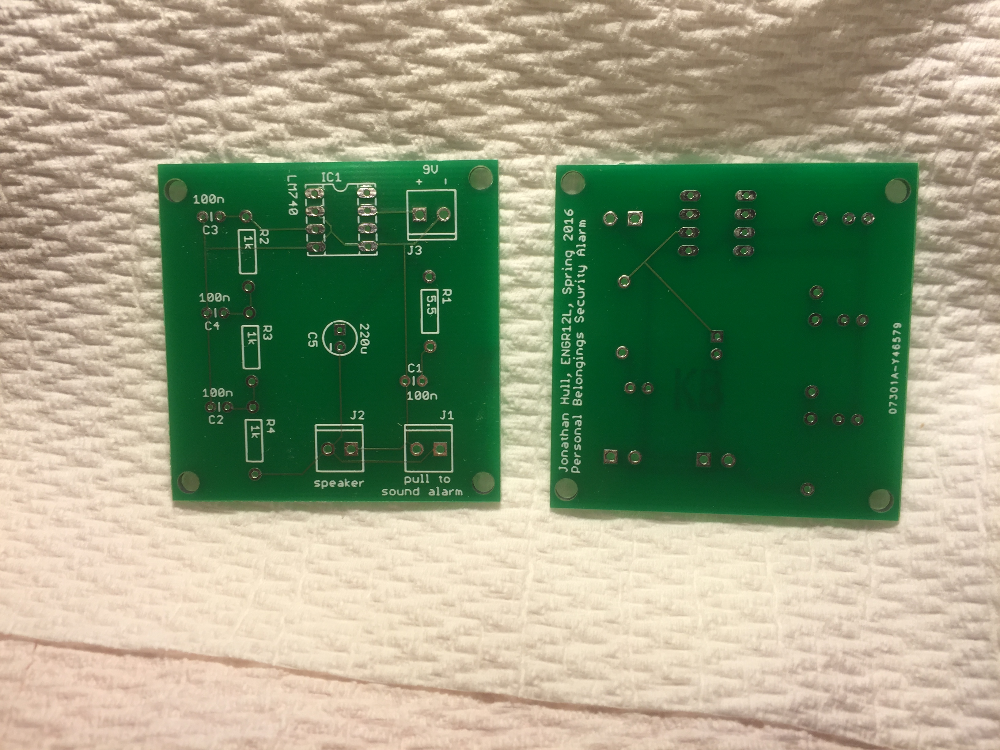
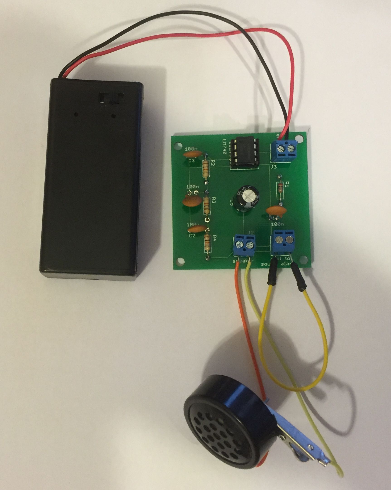
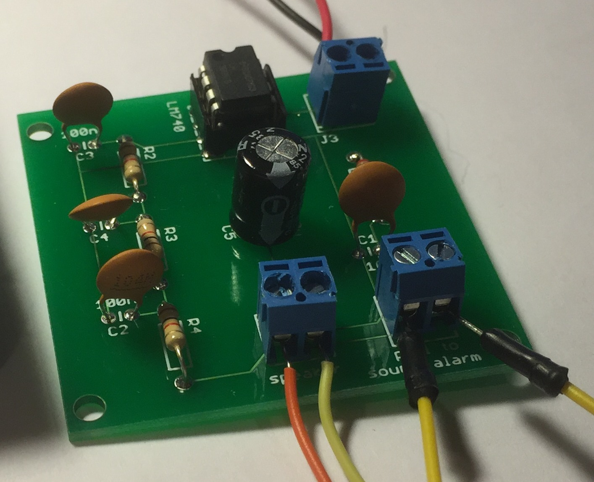

# Personal-belongings-security-alarm

This repository contains files for a term project on building an RC feedback oscillator with the LM380 opamp shown in the following schematic.  This was part of ENGR12L, Engineering Circuits Lab, at Monterey Peninsula College in the Spring 2016 semester.  This project was also part of the curriculum in an electric circuits course at Ohio Northern University in 2014-15 [1].

The primary feature of the circuit is an RC phase shift oscillator that should produce a sine wave of about 4 kHz.  The circuit is inactive until a short circuit to ground is removed at which time a distinctive sound is emitted.  Conceptually, the wire that shorts the circuit could be attached to an item in someone's pocket and the alarm would sound if the item is removed by a thief. 

# Project steps

The project was started in late April with a target completion date of June 2, 2016.  The first step was implementation of the design in circuitlab.  This helped gaining an initial understanding of the layout of the circuit but it was not possible to simulate it because a model for the LM380 opamp could not be located.  Nevertheless, circuitlab contains links to parts at Jameco that were used to order components that were not in the kit provided with the course.  Those parts were ordered and a prototype was constructed on a breadboard.

The prototype shown below was constructed with the 14 pin version of the LM380 because it was readily available from Jameco.  It was initially tested with a 6V power supply because [2] indicated that was preferred.  However, that did not work correctly.  A 9V supply was adopted based on the observation that it was used in [1].  After that, the prototype worked well.

An additional goal of building a printed circuit board (PCB) version of the circuit was pursued at the author's own volition.  The Eagle PCB design package was used because of its popularity in the Arduino community and the the fact that the free version would suffice.  

Eagle requires the user to provide a schematic and it creates a corresponding design for a PCB.  This turned out to be relatively straightforward because of the excellent directions in [3].  Within a day the board files were created that correspond to the following layout for a 2x2cm two-layer design.  The linear tracks on the layout correspond to wires in the protototype that will become copper traces on the PCB.  The components and holes for their wires are also shown.

The Eagle package also produces "Gerber files" that PCB manufacturers use to produce the actual boards.  After getting quotes from three vendors, [itead.cc](http://itead.cc) was chosen.  They agreed to produce 12 "bare boards" (without components soldered on) for $9.90.  The Gerber files were uploaded to their web site on Friday May 13 and the boards were delivered on Monday May 23.  This was relatively simple two-layer design with all "through hole" components.  Both sides of the bare board are shown below.

The final version of the board shown below was produced by soldering the components on one of the bare boards.  Happily, this worked correctly the first time it was tried.  Needless to say, this was a huge relief since a mistake could only be corrected with another ten day turnaround from itead.

# Files

The Eagle schematic, board file and Gerber files in the format required by itead are provided.  

# Conclusions

This project shows how a sine wave can be generated with a handful of low cost components and is an excellent example of a circuit with practical applications.  Production of the PCB was an interesting addition to the project that shows how an abstract design expressed in a schematic can be reduced to a form that could be used in a real product.  First hand knowledge of this process is something that every electrical enginer and computer scientist should have as they progress through their career.

# References

[1].  N. Alsbou, K. Al-Olimat, V. Labay, and H. LeBlanc, "Introducing Students to Electronic Devices and Electric Circuit Applications at Early Level in the Engineering Curriculum through Multiple Projects,"  122nd ASEE Annual Conference and Exposition, Seattle, WA, June 14-17, 2015. https://www.asee.org/public/conferences/56/papers/12964/download.

[2]. "Pull Pin Security Alarm System," http://www.electronicshub.org/pull-pin-security-alarm-system/, Aug. 5, 2015.

[3].  S. Monk, Make your own PCBs with Eagle: from schematic designs to finished boards, McGraw-Hill, 2014.
